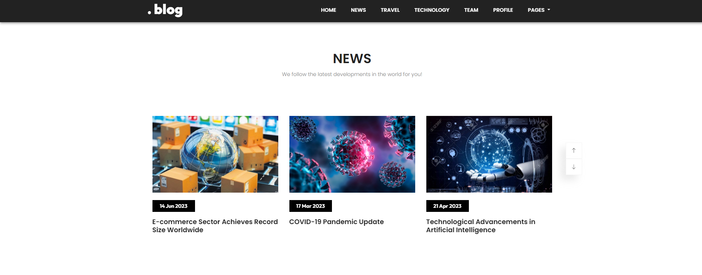
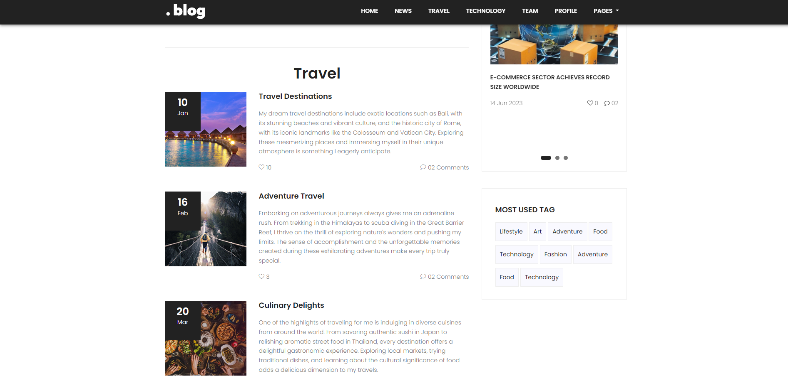
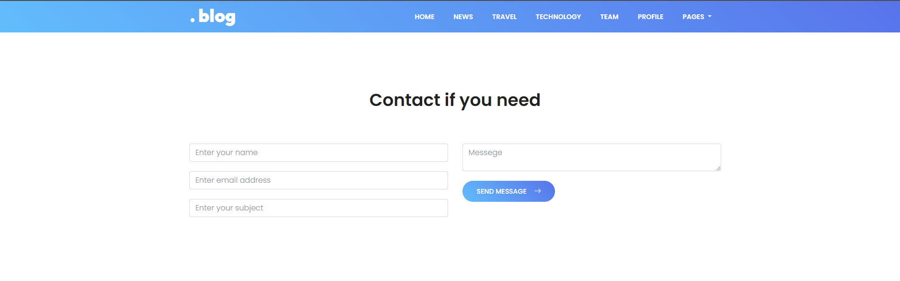
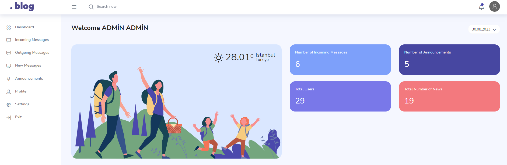
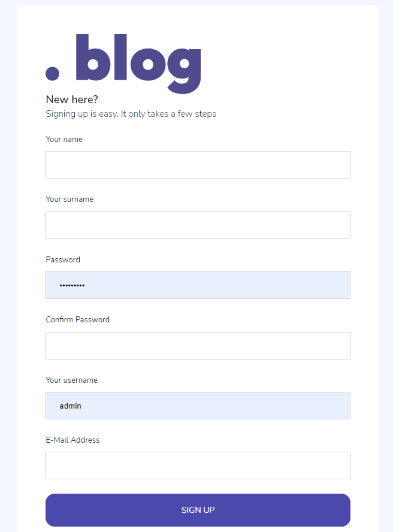
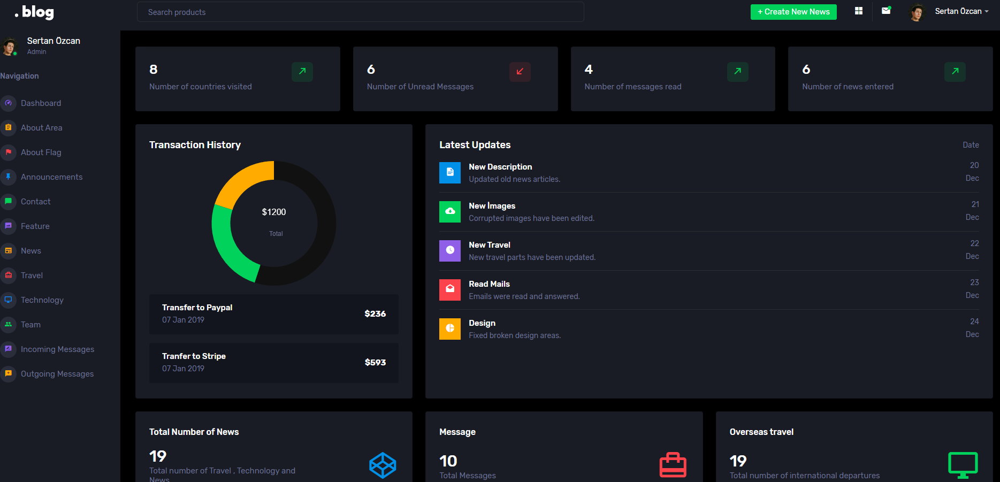
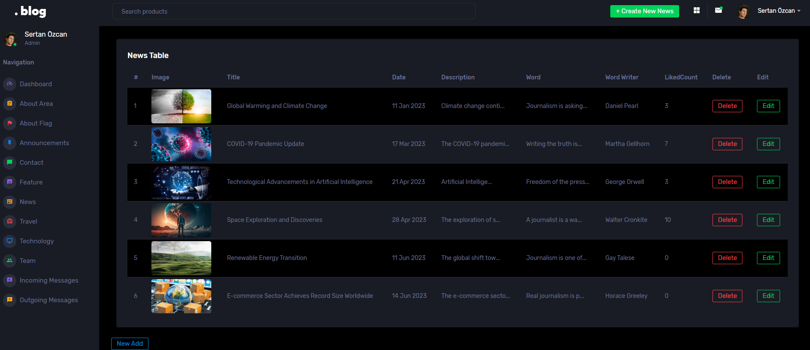

# Asp Net Core Blog Site Project
 Blog site creation with asp.net core 5.0

## HEADER

======

## CATEGORY

======

## CONTACT

======

## PANEL

======

## REGİSTER

======

## LOGİN

======

## ADMİN PANEL

======

## ADMİN EDİT-ADD-DELETE

